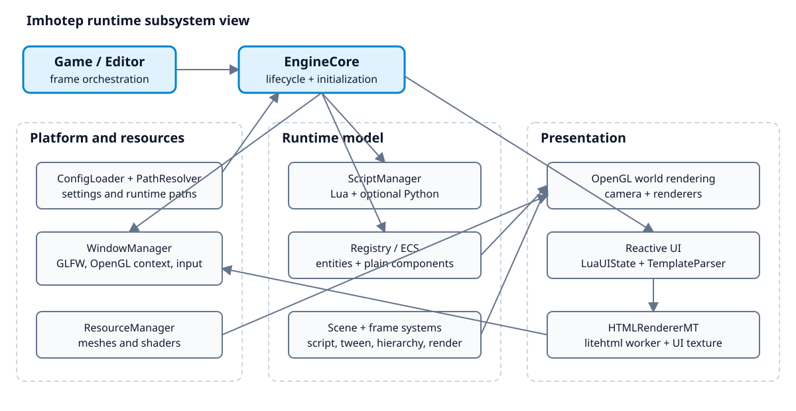
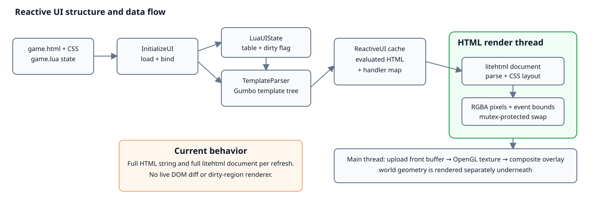
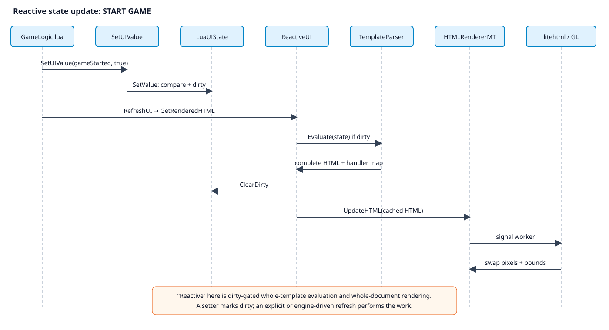
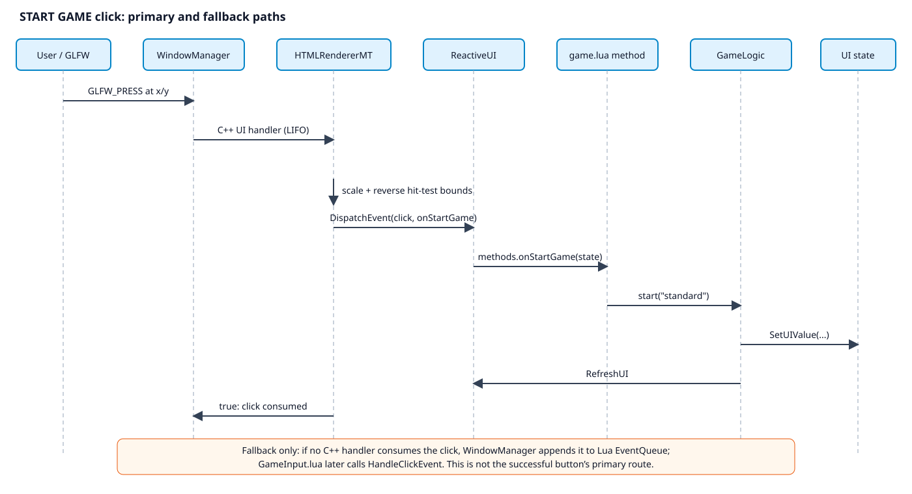

# Current engine and reactive UI architecture

Reviewed against `jordanlevy96/Imhotep-Engine` commit `161dd1f62f10f088375a94feedcd287c2c22a80c` on 2026-10-07. These views describe current code, not a proposed redesign.

## The short mental model

Imhotep is a C++/OpenGL engine whose `EngineCore` assembles platform services, an ECS, scripting, and two presentation paths. World geometry is drawn directly with OpenGL. UI is authored as HTML/CSS plus a Lua state table, evaluated into ordinary HTML on the main thread, laid out and rasterized by litehtml/FreeType on a worker, then uploaded as a texture and composited over the world.

The UI is reactive in a specific, bounded sense: setters mark `LuaUIState` dirty; the next refresh reevaluates the whole template into a complete HTML string and queues a complete litehtml render. It caches the Gumbo parse tree and Lua expressions, but does **not** currently maintain a mutable DOM, dependency graph, dirty regions, or virtual-DOM diff.

## Legacy root diagram

The root image [`Engine Class Diagram.drawio.png`](../../Engine%20Class%20Diagram.drawio.png) is retained for history but is deprecated as a description of the current engine. It presents an `App`, old component inheritance, and a `UI` class, while current runtime coordination lives in `Game`/`Editor` + `EngineCore`, components are plain ECS data, and the UI pipeline is `LuaUIState` → `ReactiveUI`/`TemplateParser` → `HTMLRendererMT`. Use the four views below as the maintained starting point.

## 1. Engine subsystem view

Source: [engine-subsystems.mmd](diagrams/engine-subsystems.mmd).

Evidence: initialization ordering is implemented in `EngineCore::Initialize` (`src/controllers/EngineCore.cpp:151`); config-driven paths and scene load are at `:84-135`; frame orchestration is in `Game` (`src/controllers/Game.cpp`). The diagram groups responsibilities instead of pretending every singleton relationship is a clean ownership edge.

## 2. UI structure and data flow

Source: [ui-data-flow.mmd](diagrams/ui-data-flow.mmd).

Concrete load path:

1. `settings.yaml` selects VaporQube’s template, stylesheet, Lua state, and scene.
2. `EngineCore::InitializeUI` loads the Lua state, binds it, combines HTML/CSS, parses/evaluates the template, installs handler metadata, and queues initial HTML (`src/controllers/EngineCore.cpp:416-468`).
3. `TemplateParser::Parse` caches a Gumbo tree; `Evaluate` walks it, applies `v-if`/`v-for`/interpolation, replaces `@click` with `data-event-id`, and returns a full HTML string (`src/systems/TemplateParser.cpp:52-145`, `:152-245`).
4. The HTML worker builds a fresh litehtml document, performs layout, draws through the custom document container into RGBA pixels, and extracts interactive bounds from the laid-out document (`src/systems/HTMLRendererMT.cpp:102-138`, `:646-715`, `:1143-1213`).
5. The main thread uploads a new front buffer to an OpenGL texture and composites a screen quad (`src/systems/HTMLRendererMT.cpp:992-1015`).

Two different internal representations matter: Gumbo is the cached **template** tree used to generate HTML; litehtml is the short-lived **layout/render** document rebuilt on each queued render. There is no shared live DOM between them.

## 3. Reactive state-change sequence

Source: [reactive-update-sequence.mmd](diagrams/reactive-update-sequence.mmd).

The real `START GAME` transition is `GameLogic:start()` calling multiple `SetUIValue` operations followed by `RefreshUI()` (`res/games/vaporqube/scripts/GameLogic.lua:37-60`). The generic bindings are in `ScriptManager.cpp:399-420`. `ReactiveUI::GetRenderedHTML` only reevaluates when dirty (`src/systems/ReactiveUI.cpp:47-68`), while `RenderWithLua` evaluates the complete template and conditionally replaces the handler map (`:148-170`).

Important limitation: explicit `RefreshUI()` immediately pushes a refresh. Setters alone only make the state dirty; some engine paths such as FPS tracking later call `GetRenderedHTML()` and `UpdateHTML()`, but this is not a general observer/subscription mechanism. The documented “dependency graph” and “render only what changed” are intended future design, not current behavior.

Exact evidence for that distinction: `LuaUIState::SetValue` compares, writes, and sets `m_isDirty` but calls no renderer (`include/systems/LuaUIState.h:220-286`); `ReactiveUI::GetRenderedHTML` evaluates only when dirty (`src/systems/ReactiveUI.cpp:47-68`); the separate `RefreshUI` binding calls `GetRenderedHTML` and `UpdateHTML` (`src/controllers/ScriptManager.cpp:416-420`). `UpdateHTML` always queues the supplied string and wakes the worker (`src/systems/HTMLRendererMT.cpp:970-990`).

## 4. Click-to-script sequence

Source: [click-dispatch-sequence.mmd](diagrams/click-dispatch-sequence.mmd).

The example begins at `
` (`res/games/vaporqube/ui/templates/game.html:8-14`). Evaluation creates an opaque event ID plus a side handler map. After litehtml layout, the renderer associates that ID with a clickable rectangle. At runtime:

- `WindowManager` tries registered C++ handlers in reverse order and only queues the event for Lua when none consumes it (`src/controllers/WindowManager.cpp:398-429`).
- `EngineCore`’s UI handler calls `HTMLRendererMT::HandleClickEvent` directly (`src/controllers/EngineCore.cpp:470-487`).
- The renderer scales window coordinates to framebuffer coordinates, reverse-hit-tests the current bounds, and dispatches the mapped expression (`src/systems/HTMLRendererMT.cpp:1225-1295`).
- `ReactiveUI::DispatchEvent` looks up `methods.onStartGame` and invokes it with the state table (`src/systems/ReactiveUI.cpp:175-256`). The Lua method calls `GameLogic:start("standard")` (`res/games/vaporqube/ui/state/game.lua:79-87`).

This corrects the old UI document: the Lua `EventQueue`/`GameInput.lua` route exists, but it is a fallback for a click not consumed by the C++ handler, not the primary successful-button route.

The primary/fallback ordering is explicit, not inferred: the GLFW callback iterates C++ handlers and returns on consumption before appending to Lua (`src/controllers/WindowManager.cpp:398-429`), while `EngineCore::InitializeUI` registers the C++ UI handler (`src/controllers/EngineCore.cpp:470-487`). The hit-test returns `true` immediately after dispatch (`src/systems/HTMLRendererMT.cpp:1236-1285`).

## What is verified versus inferred

| Claim | Confidence |
|---|---|
| Template/state load, full-string evaluation, worker render, buffer swap | Implemented; traced in current source |
| START GAME bounds → dispatch → `data.gameStarted=true` | Covered by the real `engine.click` integration test (`src/controllers/Game.cpp:195-289`) |
| Headless expression/state-adjacent behavior | Covered by `engine.unit` and VaporQube Lua behavior tests |
| Exact timing/performance numbers in the older UI document | Historical; not re-benchmarked here |
| “Dirty region rendering”, dependency-graph updates, DOM diffing | Intended/claimed by old docs; not implemented in this path |
| All CSS/HTML features | Unknown; constrained by litehtml plus the custom `document_container`, not a browser engine |

## Maintenance note

The `.mmd` files are the editable sources. GitHub can render Mermaid embedded in Markdown, while the checked SVG and PNG files make the views readable in editors and static documentation viewers. When code changes, update the small responsibility-level diagrams rather than regenerating an exhaustive class graph.

The four SVG previews were rasterized locally with `rsvg-convert` and visually reviewed individually. Mermaid CLI was not available locally, so the `.mmd` sources were reviewed as text but not parser-validated; no package was installed.

## Verification performed

- Existing build at current `develop` rebuilt successfully with `cmake --build build -j4`.
- Headless CTest targets passed: `vaporqube.lua.behavior`, `engine.unit`, and `engine.registry-liveness`.
- Display-backed targets passed: `engine.smoke` and `engine.click`.
- Runtime verification used the unchanged engine code at base commit `161dd1f`; this guide and its diagram sources/renders are now checked into the documentation branch.

## Guided read and experiment

1. Start with the click view and put these files side-by-side: `game.html:8-14`, `game.lua:79-87`, and `GameLogic.lua:37-60`. That is the smallest complete author-facing story: directive → UI method → gameplay method → state writes.
2. Follow the C++ middle in order: `EngineCore.cpp:470-487` registers the primary handler; `HTMLRendererMT.cpp:1225-1295` scales and hit-tests; `ReactiveUI.cpp:175-256` resolves and invokes the Lua method. Then compare `WindowManager.cpp:398-429` to see precisely when the Lua input-queue fallback is used.
3. From the repository build, run `ctest --test-dir build -R engine.click --output-on-failure`. The test locates the real `onStartGame` bounds, clicks their center, and asserts `data.gameStarted` changes from false to true (`Game.cpp:195-289`). For the scheduling nuance, temporarily reason through—not edit—the difference between `SetUIValue` (`ScriptManager.cpp:399-414`) and `RefreshUI` (`:416-420`): the former marks dirty through `LuaUIState::SetValue`; the latter actually asks for evaluated HTML and queues it.
